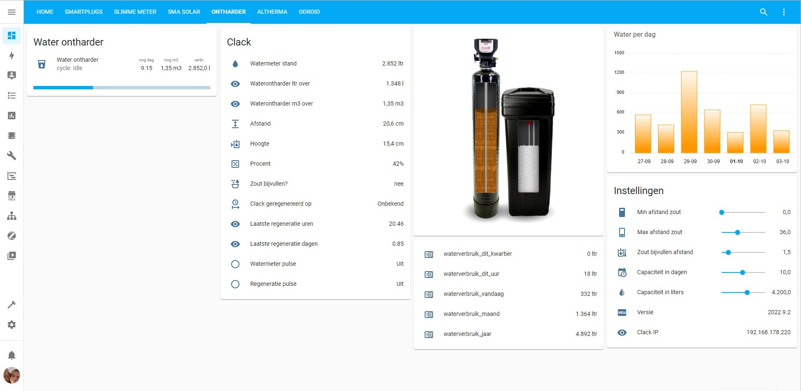

# Clack - Lezer

## Lovelace menu
Om het lovelace menu volledig te benutten dient via hacs (frontend)
de volgende repositories geinstalleerd te worden (verkennen en downloaden)

Voorbeeld dahsboard: 


* stack-in-card
* multiple-entity-row
* bar-card
* apexcharts  (staafdiagram)

## Automations
[automations.yaml](../automations.yaml) samenvoegen met de bestaande automations.yaml
en [clack.yaml](../clack.yaml) samenvoegen met configuration.yaml 

### Bestand op eigen lokatie: 
of op een eigen lokatie zetten:
configuration.yaml aanpassen naar:

```yml
homeassistant:
  packages: !include_dir_named packages
```

Dan directory /packages aanmaken in /config en daar de clack.yaml in kopieren
HA opnieuw starten

## Configuratie
### Clack.yaml
In clack.yaml moeten de tijden nog aangepast worden aan je eigen tijden (timer) voor de simulatie van het regenereren in HA.
Even met een stopwatch ofzo, nadat de regeneratie handmatig gestart is. Elke keer dat de inwendige schuif beweegt is een stap (zie ook het display vd clack)

Bijgevoegd ook de plaatjes voor de simulatie van het zoutniveau:
naar /www/images kopieren

### Relais configuratie
De werking van de 2 relays moeten nog in de clack ingesteld worden:
* Relay 1 is voor de waterpulsen te tellen tijdens normale werking
* Relay 2 is voor eenmalig een puls te geven wanneer de ontharder regenereerd
Achter op de print staat welk draadje voor wat is om aan de relays aan te sluiten (de 3 aderige stekkerblok) 


Instellen: [Settings PDF](instelkaart%20clack%20ws1.pdf) Volledige handleiding in Engels: [Manual](Full-CLACKWS1-Manual.pdf)
1. next + pijltje omlaag -> 5 sec vasthouden
2. next (softening) is dan zichtbaar
3. doordrukken op next tot <rlY 1>  Deze op ON zetten (softening  L)
4. next
5. Dan op 2 L zetten  (elke flowmeter puls is dan 2 ltr)
6. next
7. set time: 0.01 min
8. next
9. set rlY 2 "time" to on  (geeft dan een puls bij regeneratie start)
10. next
11. set time: 0.01 min
12. 2x next en klaar

Succes!

## Noot:
Het monteren van de esp print in de behuizing is wel wat lastig.
De ESP print steekt achter de rand naar binnen, van de clack behuizing zodat deze weer gesloten kan worden met de kap.
Soms wil het esp printje uit de pinnen komen. (iets of wat speling mag wel)


